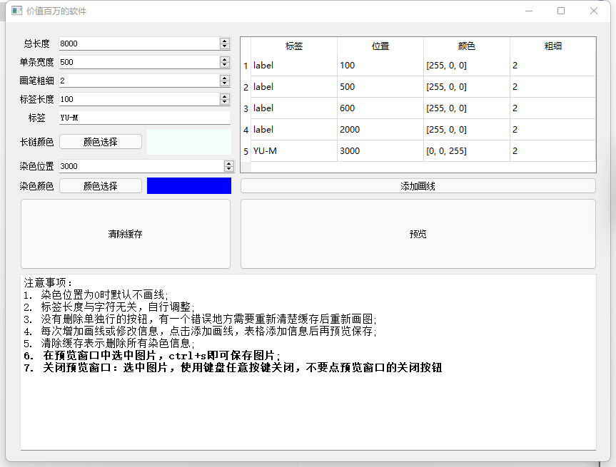

# chromosome

# 1. 功能介绍

给朋友写的用于标注染色体中DNA位置的画图软件




# 2. 安装与使用

## 1. 直接使用

windows : 运行01-program/dist/chromosome.exe

ubuntu: 

```bash
./ubuntu/main
# 有个小问题没改，ubuntu的长链大小不能跟随设置label长度变化，不改label长度的话可以正常用
```

## 2. 编译使用

1. Dependencies：

   python==3.6.13

   ```bash
   pip install -r requirements.txt
   ```

   opencv-python == 3.4.2.16
   pyqt5 == 5.15.6
   numpy == 1.19.5

   pyinstaller

2. Run

   ```python
   python chromosome.py
   ```

3. packing

   ```bash
   pyinstaller -F chromosome.py
   ```

   [pyinstaller教程](https://zhangguixin.top/2022/01/01/程序设计/pyinstaller使用/)


